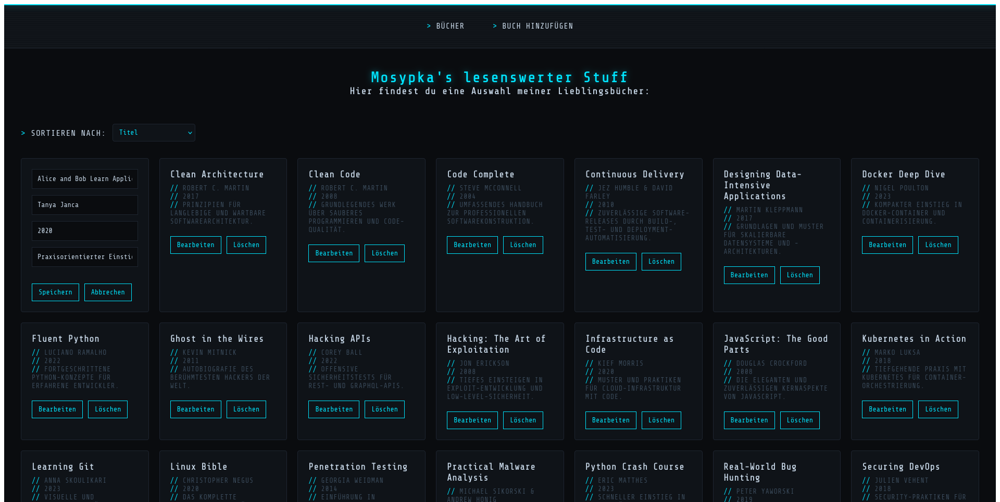
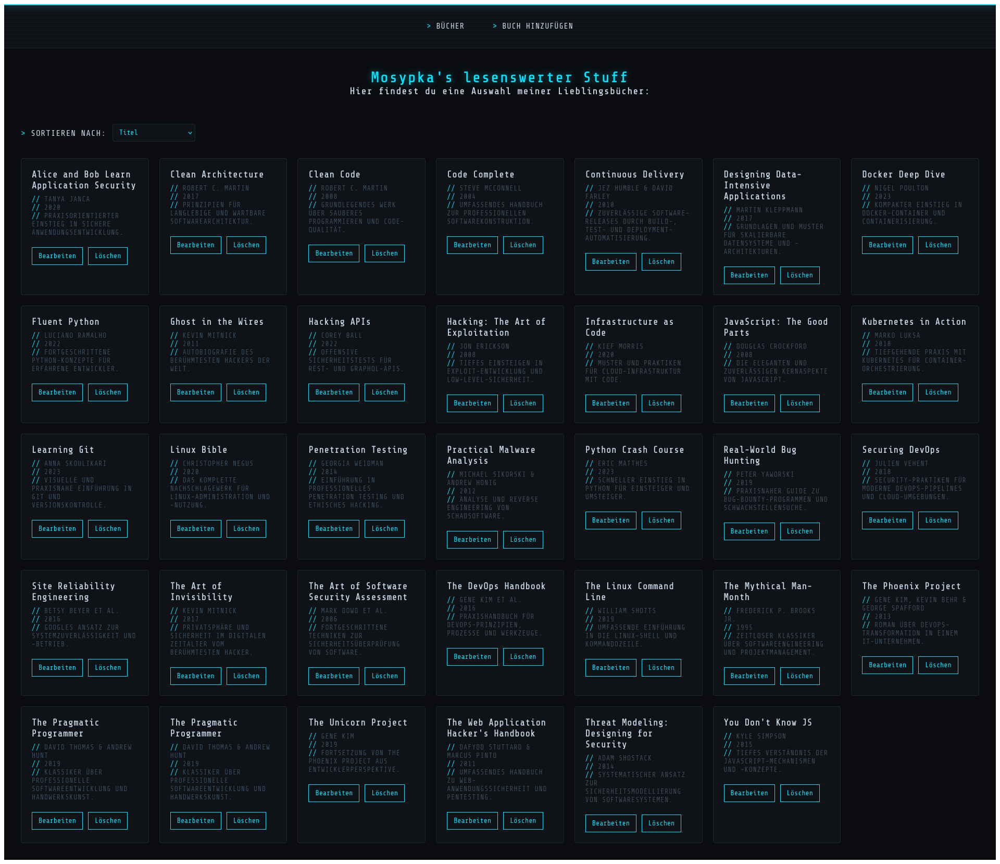

# 📚 Buchladen – GraphQL/Apollo CRUD-Projekt


> **Ein vollständiges CRUD-Übungsprojekt zur Verwaltung eines Bücherbestands. Kein reiner Boilerplate-CRUD –
> sondern bewusst aufgebaut, um den kompletten modernen JS-Stack einmal end-to-end zu durchlaufen:
> React-Frontend, GraphQL-API-Schicht über Apollo Server, und MongoDB als Datenbank via Mongoose.**

---

## 🎬 Demo

### Bücherliste

*Übersicht aller Bücher als Karten, mit Sortierung nach Titel, Autor oder Erscheinungsjahr*

### Buch bearbeiten

*Inline-Bearbeitung direkt in der Karte, ohne separate Detailseite*

---

## ⚡ Quick Start

```bash
# 1. Repository klonen
git clone git@github.com:mosypka/buchlisteCRUD.git
cd buchlisteCRUD

# 2. Backend
cd backend
npm install
node server.js

# 3. Frontend (neues Terminal)
cd frontend
npm install
npm run dev
```

**Dann im Browser öffnen:** `http://localhost:5173` 🎉
GraphQL-Sandbox zum manuellen Testen: `http://localhost:3000/graphql`

> **Voraussetzung:** MongoDB muss lokal laufen (z. B. als `systemd`-Service: `systemctl status mongod`)

---

## ✨ Highlights

- 📖 **Vollständiges CRUD** – Bücher anlegen, anzeigen, bearbeiten, löschen
- 🔀 **GraphQL statt REST** – ein einziger Endpunkt, Client bestimmt selbst, welche Felder er braucht
- 🗂️ **Sortierung** – clientseitig nach Titel, Autor oder Erscheinungsjahr
- 🧭 **Routing** – eigene Seiten für Übersicht und Buch-Erfassung via React Router
- 🧩 **Saubere Komponentenarchitektur** – klare Trennung von Seiten (`routes/`), wiederverwendbaren Bausteinen (`components/`) und State/Props

<details>
<summary>📋 Alle Features anzeigen</summary>

### 📋 Bücherverwaltung
- ✅ Bücher als Karten-Grid anzeigen
- ✅ Neues Buch über eigene Seite (`/buch-hinzufuegen`) anlegen
- ✅ Inline-Bearbeitung direkt in der Karte (Umschalten zwischen Anzeige- und Bearbeitungsmodus)
- ✅ Buch löschen mit eigener Komponente
- ✅ Sortierung über Dropdown (Titel / Autor / Erscheinungsjahr)

### 🧭 Navigation & Routing
- ✅ Globale Navigationsleiste (`react-router-dom`'s `<Link>`), außerhalb von `<Routes>` platziert
- ✅ Root-Pfad (`/`) leitet automatisch auf `/buecher` weiter
- ✅ Eigene Route für Buch-Erfassung (`/buch-hinzufuegen`)

### 🌐 GraphQL-API
- ✅ Vollständiges Schema (`typeDefs`) für Query und Mutation
- ✅ Resolver greifen über Mongoose auf MongoDB zu
- ✅ Schema-Validierung über Mongoose (Pflichtfelder, Typen)

</details>

---

## 🗺️ Roadmap

### 🎯 Version 1.0 (Aktuell)
- ✅ Vollständiger CRUD-Workflow über GraphQL/Apollo
- ✅ Sortierung
- ✅ Eigene Routen für Übersicht und Erfassung
- ✅ Inline-Bearbeitung in der Karte

### 🔄 Version 2.0 (Geplant)
- 🔨 **Validierung im Bearbeiten-Formular** (leere Pflichtfelder verhindern)
- 🔨 **Bestätigungsdialog** vor dem Löschen
- 🔨 **Detailseite pro Buch** (`/buecher/:id` via `useParams`)
- 🔨 **Apollo Client** statt `graphql-request` für Caching/optimistische Updates
- 🔨 **`nodemon`** fürs Backend (Auto-Reload bei Code-Änderungen)

---

## 🛠️ Tech-Stack

| Bereich | Technologie |
|---|---|
| Frontend | React, Vite, React Router |
| API-Layer | GraphQL, Apollo Server |
| Backend | Node.js, Express |
| Datenbank | MongoDB, Mongoose |
| HTTP-Client (Frontend) | graphql-request |

---

## 🌐 GraphQL-Schema (Auszug)

```graphql
type Buch {
  id: ID
  titel: String
  autor: String
  erscheinungsjahr: Int
  beschreibung: String
}

type Query {
  buecher: [Buch]
  buch(id: ID): Buch
}

type Mutation {
  buchHinzufuegen(titel: String, autor: String, erscheinungsjahr: Int, beschreibung: String): Buch
  buchLoeschen(id: ID): Buch
  buchaendern(id: ID, titel: String, autor: String, erscheinungsjahr: Int, beschreibung: String): Buch
}
```

---

## 📁 Projektstruktur

```
buchladen-vite/
│
├── backend/
│   ├── server.js                 # Express + Apollo Server + Mongoose Setup
│   ├── package.json
│   └── node_modules/
│
└── frontend/
    ├── src/
    │   ├── App.jsx                # React Router Konfiguration
    │   ├── main.jsx                # Einstiegspunkt, BrowserRouter
    │   ├── routes/
    │   │   ├── BuecherSeite.jsx
    │   │   ├── BuecherSeite.css
    │   │   └── BuchHinzufuegen.jsx   # Formular für Create-Mutation, eigene Route
    │   └── components/
    │       ├── Navigation.jsx     # Globale Navigation, außerhalb von <Routes>
    │       ├── Navigation.css
    │       ├── BuchListe.jsx      # Holt Daten via GraphQL, hält State, Sortierung
    │       ├── BuchListe.css
    │       ├── BuchKarte.jsx      # Zeigt einzelnes Buch (Props), togglet Bearbeiten-Modus
    │       ├── BuchKarte.css
    │       ├── BuchBearbeiten.jsx  # Formular für Update-Mutation
    │       └── BuchLoeschen.jsx    # Button für Delete-Mutation
    ├── package.json
    └── node_modules/
```

---

## 🏗️ Architektur-Prinzip: Separation of Concerns

- **`routes/`** → ganze Seiten/Views (verknüpft mit einer URL über React Router)
- **`components/`** → wiederverwendbare UI-Bausteine
- **State** lebt dort, wo Daten geholt/verändert werden (`BuchListe`)
- **Props** fließen von oben nach unten zu reinen Anzeige-Komponenten (`BuchKarte`)

---

## 📦 Backend-Pakete

```bash
npm install express mongoose @apollo/server @as-integrations/express5 graphql cors
```

> **Versionshinweis:** Ab Apollo Server v5 ist die Express-Integration nicht mehr im Hauptpaket enthalten (`@apollo/server/express4` existiert nicht mehr). Stattdessen wird das separate Paket `@as-integrations/express5` benötigt.

## 📦 Frontend-Pakete

```bash
npm install react-router-dom graphql-request graphql
```

---

## ⚠️ Bekannte Grenzen

- Keine Authentifizierung/Autorisierung – reines Lern-/Übungsprojekt
- Sortierung läuft clientseitig, nicht serverseitig (bei großen Datenmengen ineffizient)
- Keine Formular-Validierung im Bearbeiten-Dialog

---

## 💡 Entstehung und Arbeitsweise

Buchladen ist ein Übungsprojekt im Rahmen meiner Weiterbildung zum Fullstack Webentwickler,
gezielt zur Vertiefung von Node.js, Express, MongoDB/Mongoose und GraphQL/Apollo.

Das Projekt wurde eigenständig konzipiert und entwickelt. Bei der Umsetzung habe ich
gezielt KI-gestützte Werkzeuge (u. a. als Pair-Programmer, für Code-Reviews und zur
Klärung technischer Fragen) eingesetzt – ähnlich wie Entwickler heute Linter,
Dokumentation oder Stack Overflow nutzen.

Alle Architekturentscheidungen und das Debugging lagen durchgehend bei mir.

---

## 📬 Kontakt

**Matthias Osypka**

[](mailto:mosypka@tutamail.com)
[](https://github.com/mosypka)

💡 **Suche nach:** Entwickler Position im Bereich Fullstack Web Entwicklung

---

## 📄 License

MIT License – siehe [LICENSE](LICENSE) Datei

---

[⬆ Nach oben](#-buchladen--graphqlapollo-crud-projekt)

